## Check Git Version
```sh
git --version
```
you'll see something like `git version 2.39.1.windows.1` <br>
or if the command is unrecognized then for windows, you've to install git from
<a> https://git-scm.com/download/win </a>
<hr>


## Git Configuration 
### For Global Setup
```aidl
git config --global user.name 'your_username'
```
```aidl
git config --global user.email 'your_email'
```


<br>
For Local Folder Setup 

```aidl
git config --local user.name 'your_username'
```
```aidl
git config --local user.email 'your_email'
```
<br>
<br>
Now, to check global git configuration, run:

```aidl
git config --global --list
```
you'll see something like below:
<br>
`filter.lfs.smudge=git-lfs smudge -- %f`<br>
`filter.lfs.process=git-lfs filter-process` <br>
`filter.lfs.required=true` <br>
`filter.lfs.clean=git-lfs clean -- %f`  <br>
`user.name=Rifat Shariar Sakil`   // `my username`<br>
`user.email=shariarsakil101@gmail.com` // `my email`<br> 
`core.editor=code --wait` // `default code editor VS Code was set` <br>
`init.defaultbranch=main`  // `default starting branch` `$main` `is chosen`<br>
<br>
or, for local git configuation run: 

```aidl
git config --local --list
```
<hr>


## Initialize Git

`navigate to your directory` 
<br> <br>
make sure no git is already initialized:
```aidl
git status
```
output: `fatal: not a git repository (or any of the parent directories): .git` <br>

Now, Initialize Git:
```aidl
git init
```
<hr>


<br>

## Dive Into Git


Basically:
`modify file` => `stage changes` => `commit changes`<br>

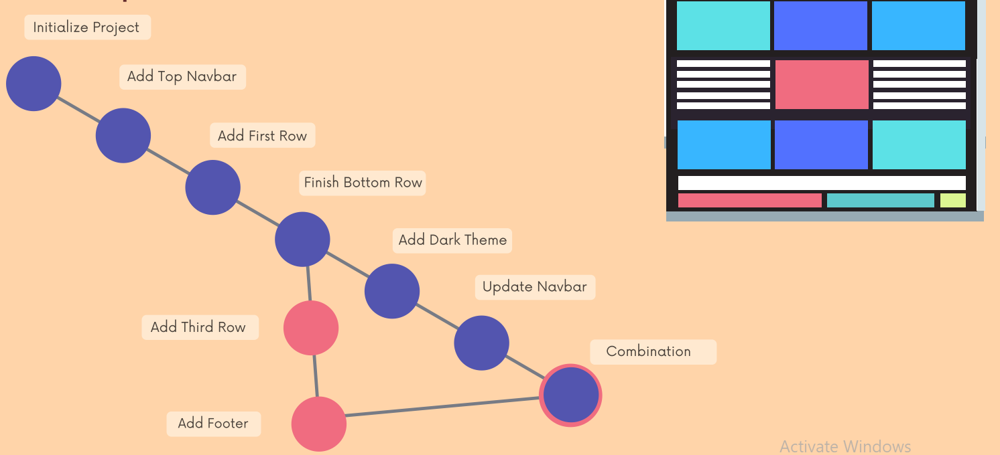
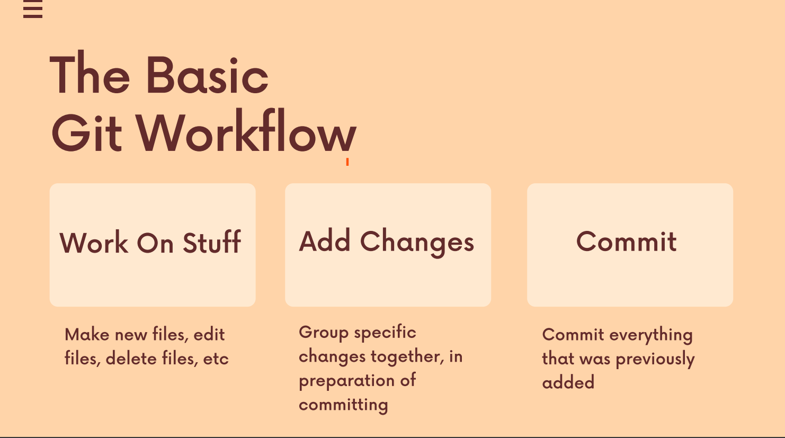
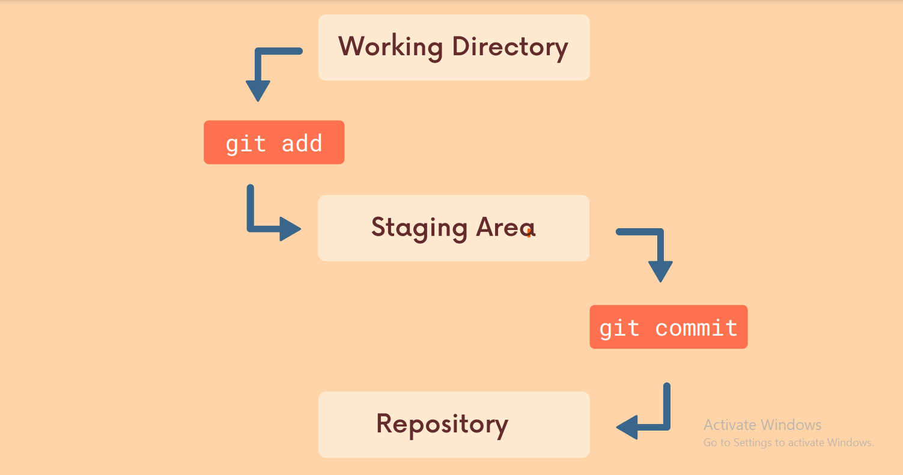
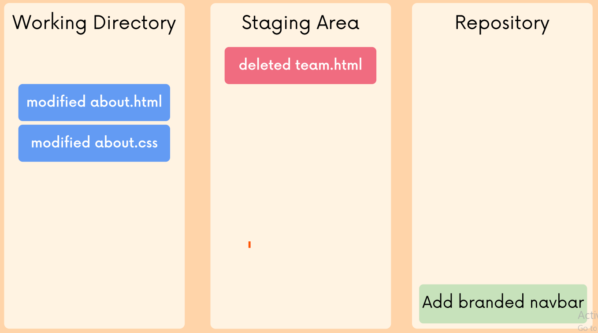

<br>
<br>

# Git Commit
`modify file` => `stage changes` => `commit changes`<br>
<br>
check for modifications to be staged:
```aidl
git status
```
<br>

`You can't commit without staging files`
<br>
<br>
now,
staging single file:
```aidl
git add filename.txt
```
<br>

multiple file stage:
```aidl
git add filename1.txt filename2.txt
```

<br>

stage all changes at once:
```aidl
git add --all
```
<br>

now, again check status of all files:
```aidl
git status
```


<br>
commit staged changes:

```aidl
git commit -m 'commit message' 
```
<br>

git stage and commit in one-line:
```aidl
git commit -a -m 'commit message'
```
<br>


check git commit log:
```aidl
git log
```
or git log in oneline:
```aidl
git log --oneline
```
<br>
modify last commit:

```aidl
git commit --amend
```
`This will open your code editor and there you can update the commit message`
<br>
<br>

To add more files to the last commit:
```aidl
git add forgottenFile.txt
git commit --amend
```


<br>

unstage file:
```aidl
git rm --cached index.txt
```


`modify => stage => commit  |=> sleep :V`
<hr>


# Branch
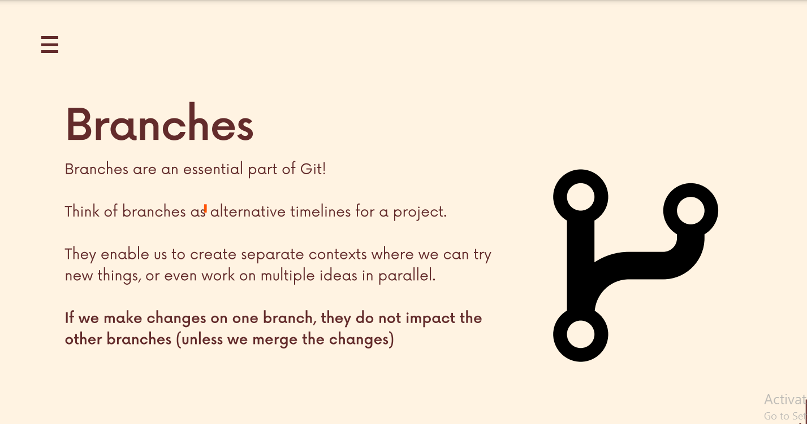
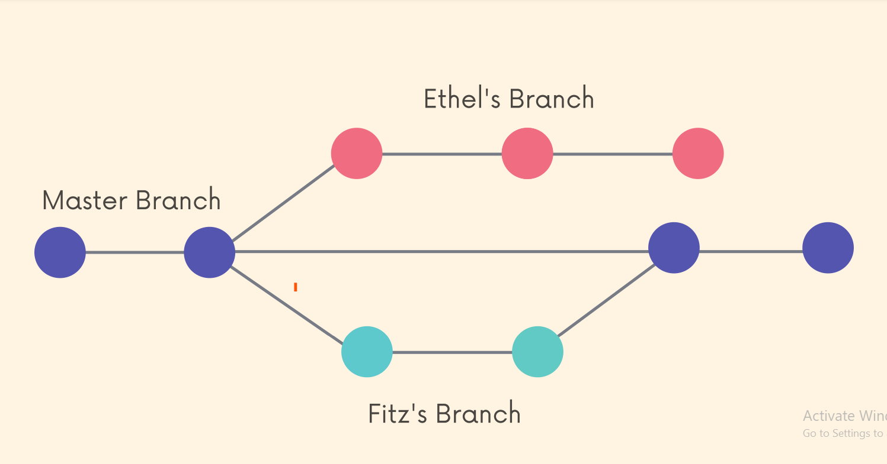

<br>

`In git, we are always working on a branch` <br>
`The default branch name is master` <br>
`Technically default branch is` `main` or `master` <br>

check default branch:
```aidl
git config --global init.defaultbranch
```

output: `main` or `master` <br> <br>

you can change default branch from git next initialization for all directories:
```aidl
git config --global init.defaultbranch 'default_branch_name'
```
`remember default branch name of current directory is already fixed when we initialized git`

<br>
check all current branches:

```aidl
git branch
```
output : `master` as right now we've only one branch
<br> 
<br>

new branch create:

```aidl
git branch <new-branch-name>
```
now if we run:
```aidl
git branch
```
we'll see: <br>
`<new-branch>` <br>
`*master`

<br>

switch to new branch:
```aidl
git switch <new-branch>
```
or 
```aidl
git checkout <new-branch>
```
<br>


branch create and switch in oneline:
```aidl
git switch -c <branch-name>
```
or 
```aidl
git checkout -b <branch-name>
```
<br>

Use the `-v` flag with `git branch` to view more
information about each branch:
```aidl
git branch -v
```
<br>

use the `-d` flag to delete a branch
```aidl
git branch -d <branch-name>
```
<br>

`Remember:` <br> 
`1. The new branch will inherit all the commits history from the branch it was created from as those commits were done in this new branch` 
<br>
`2. Suppose two branch have same file. If we update the file in one branch, without committing or stashing the changes, you can't switch to another branch.
but you can switch to another branch if the files are non-conflicting. But the non-conflicting file
will follow you to the switched branch.`

<br>

## Branch Merging

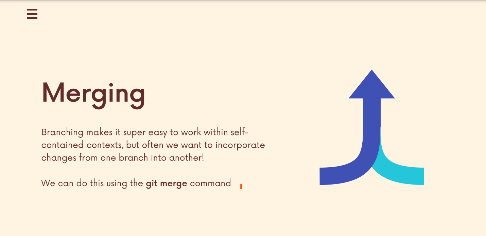

Imagine, we've only one branch, which is the default one, `main` branch. <br>
Let's say, it has two commits. Now let's create another branch by: `git branch shariar` <br> 
Let's move to `shariar` branch, and make one or few commits. <br>
We want to merge this `shariar` branch with `main` branch. <br>
So go back to `main` branch by: `git switch main` <br>

Now, merge `shariar` from `main` branch by:
```aidl
git merge shariar
```
`This is called fast forward merging`
<br>
`*Not all merges are fast forwards`

<br>

what if we add a new commit on `main` or `master` branch `like below` and then try to merge?

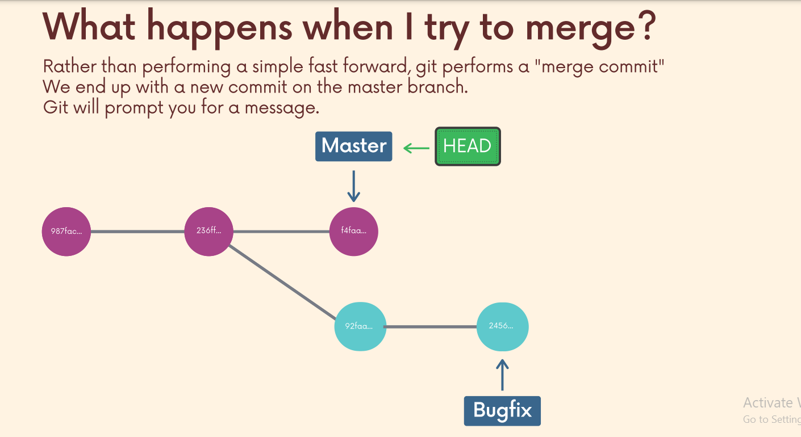 <br> <br> <br>

we'll end up like `below`, right? 

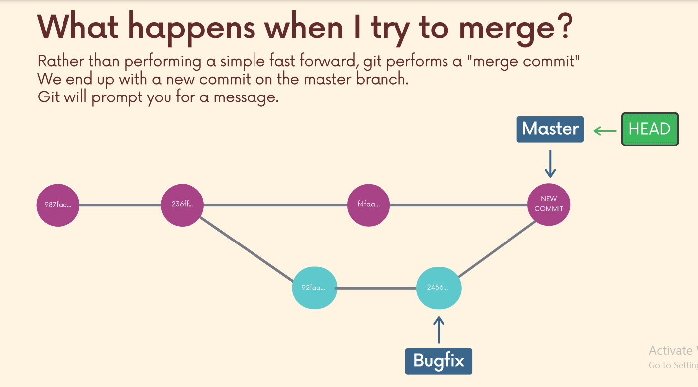 <br> <br> <br>


we'll, there's the `catch!`

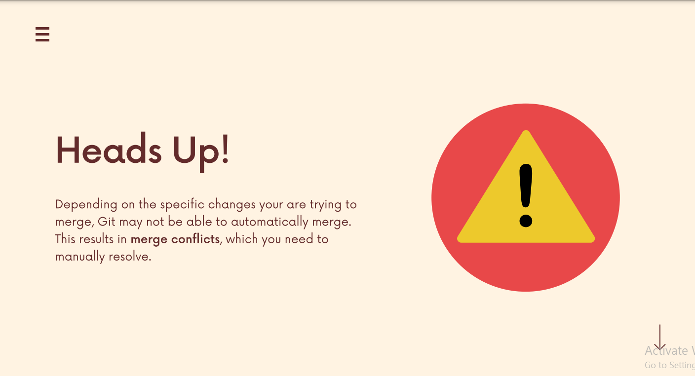


To sum up, let's say `master` branch and the `BugFix` branch have `non-conflicting` files.
Then the git will `automatically` merge the two branches. But when the two branches have `con-flicting file changes` 
`merge conflict` will happen while merging, then we've to `manually` `accept incoming changes or decline changes from the editor`

<br>

Remember: <br>
`1. We merge branches, not specific commits` <br>
`2. We always merge to the current HEAD branch`<br>

<br>


## Git Diff
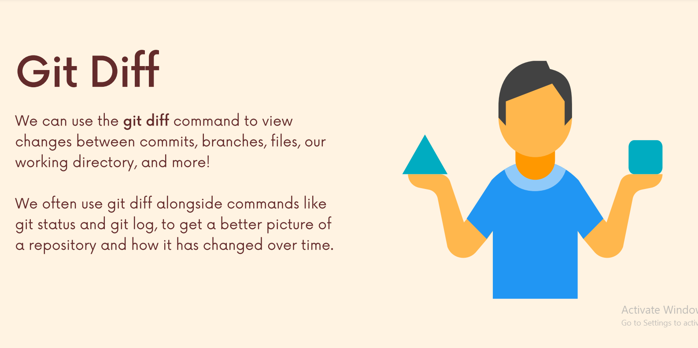 
<br>
<br>
<br>
`git diff` lists all the
changes in your working directory that are NOT
staged for the next commit. Basically `working tree vs staging area`
```aidl
git diff
```
<br>

`git diff HEAD` lists all changes in the working tree since your last commit. Basically `working tree vs commit`

```aidl
git diff HEAD
```

<br>

`git diff --staged` or `git diff --cached` lists all changes between the staging area and the last commit:
Basically `staging area vs commit`
```aidl
git diff --staged
```
or
```aidl
git diff --cached
```
<br>

specfific file difference `between working tree and the last commit `:

```aidl
git diff HEAD [filename]
```


<br>

specfific file difference `between staging area and the last commit`:

```aidl
git diff --staged [filename]
```
<br>

comparing branches:
```aidl
git diff branch1..branch2
```

<br>

comparing commits:
```aidl
git diff commit1..commit2
```


<hr>


