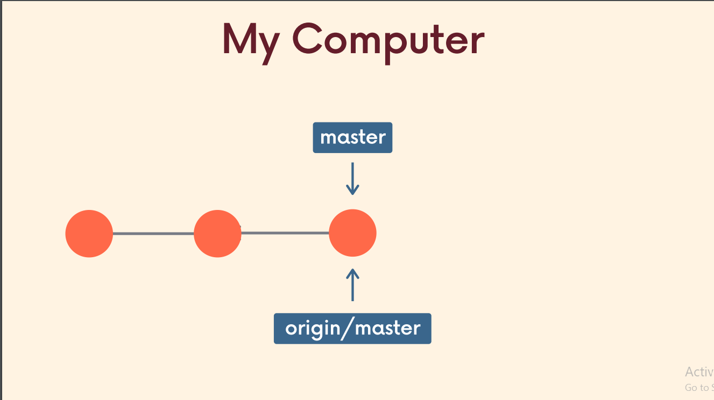

## Check Git Version
```sh
git --version
```
you'll see something like `git version 2.39.1.windows.1` <br>
or if the command is unrecognized then for windows, you've to install git from
<a> https://git-scm.com/download/win </a>
<hr>


## Git Configuration 
You can view all of your settings and where they are coming from using:
```aidl
git config --list --show-origin
```
### For Global Setup
```aidl
git config --global user.name 'your_username'
```
```aidl
git config --global user.email 'your_email'
```


<br>

### Or For Local Folder Setup (Better Skip) 

```aidl
git config --local user.name 'your_username'
```
```aidl
git config --local user.email 'your_email'
```
<br>
<br>
Now, to check global git configuration, run:

```aidl
git config --global --list
```
you'll see something like below:
<br>

    filter.lfs.smudge=git-lfs smudge -- %f`
    filter.lfs.process=git-lfs filter-process` 
    filter.lfs.required=true` 
    filter.lfs.clean=git-lfs clean -- %f`  
    user.name=Rifat Shariar Sakil`   // `my username`
    user.email=shariarsakil101@gmail.com` // `my email`
    core.editor=code --wait` // `default code editor VS Code was set` 
    init.defaultbranch=master`  // `default starting branch` 
<br>
or, for local git configuation run: 

```aidl
git config --local --list
```
<br>


### Default branch name
By default Git will create a branch called `master` when you create a new repository with git init.
From `Git version 2.28` onwards, you can set a different name for the initial branch.
To set main as the default branch name do:
```aidl
git config --global init.defaultBranch main
```

<br>

### Default Code Editor
```aidl

```


<hr>
<br>


## Initialize Git

`navigate to your directory` 
<br> <br>
make sure no git is already initialized:
```aidl
git status
```
output: 

    fatal: not a git repository (or any of the parent directories): .git 


<br>

Now, Initialize Git:
```aidl
git init
```

<br>

Use `git status -s` or `git status --short` for far more simplified output
```aidl
git status -s
```
or 
```aidl
git  status --short
```
<hr>


<br>

## Dive Into Git


Basically:
`modify file` => `stage changes` => `commit changes`<br>


<br>
<br>

# Git Commit
`modify file` => `stage changes` => `commit changes`<br>
<br>
check for modifications to be staged:
```aidl
git status
```
<br>

`You can't commit without staging files`
<br>
<br>
now,
staging single file:
```aidl
git add filename.txt
```
<br>

multiple file stage:
```aidl
git add filename1.txt filename2.txt
```

<br>

stage all changes at once:
```aidl
git add --all
```
<br>

now, again check status of all files:
```aidl
git status
```


<br>
commit staged changes:

```aidl
git commit -m 'commit message' 
```
<br>

git stage and commit in one-line:
```aidl
git commit -a -m 'commit message'
```
<br>


check git commit log:
```aidl
git log
```
or git log in oneline:
```aidl
git log --oneline
```
<br>
modify last commit:

```aidl
git commit --amend
```
`This will open your code editor and there you can update the commit message`
<br>
<br>

To add more files to the last commit:
```aidl
git add forgottenFile.txt
git commit --amend
```


<br>

unstage file:
```aidl
git rm --cached index.txt
```


`modify => stage => commit  |=> sleep :V`
<hr>


# Branch


<br>

`In git, we are always working on a branch` <br>
`The default branch name is master` <br>
`Technically default branch is` `main` or `master` <br>

check default branch:
```aidl
git config --global init.defaultbranch
```

output: `main` or `master` <br> <br>

you can change default branch from git next initialization for all directories:
```aidl
git config --global init.defaultbranch 'default_branch_name'
```
`remember default branch name of current directory is already fixed when we initialized git`

<br>
check all current branches:

```aidl
git branch
```
output : `master` as right now we've only one branch
<br> 
<br>

new branch create:

```aidl
git branch <new-branch-name>
```
now if we run:
```aidl
git branch
```
we'll see:

    <new-branch> 
    *master

<br>

switch to new branch:
```aidl
git switch <new-branch>
```
or 
```aidl
git checkout <new-branch>
```
<br>


branch create and switch in oneline:
```aidl
git switch -c <branch-name>
```
or 
```aidl
git checkout -b <branch-name>
```
<br>

Use the `-v` flag with `git branch` to view more
information about each branch:
```aidl
git branch -v
```
<br>

use the `-d` flag to delete a branch
```aidl
git branch -d <branch-name>
```
<br>

`Remember:` <br> 
`1. The new branch will inherit all the commits history from the branch it was created from as those commits were done in this new branch` 
<br>
`2. Suppose two branch have same file. If we update the file in one branch, without committing or stashing the changes, you can't switch to another branch.
but you can switch to another branch if the files are non-conflicting. But the non-conflicting file
will follow you to the switched branch.`

<br>

## Branch Merging


Imagine, we've only one branch, which is the default one, `main` branch. <br>
Let's say, it has two commits. Now let's create another branch by: `git branch shariar` <br> 
Let's move to `shariar` branch, and make one or few commits. <br>
We want to merge this `shariar` branch with `main` branch. <br>
So go back to `main` branch by: `git switch main` <br>

Now, merge `shariar` from `main` branch by:
```aidl
git merge shariar
```
`This is called fast forward merging`
<br>
`*Not all merges are fast forwards`

<br>

what if we add a new commit on `main` or `master` branch `like below` and then try to merge?

 <br> <br> <br>

we'll end up like `below`, right? 

 <br> <br> <br>


we'll, there's the `catch!`


To sum up, let's say `master` branch and the `BugFix` branch have `non-conflicting` files.
Then the git will `automatically` merge the two branches. But when the two branches have `con-flicting file changes` 
`merge conflict` will happen while merging, then we've to `manually` `accept incoming changes or decline changes from the editor`

<br>

Remember: <br>
`1. We merge branches, not specific commits` <br>
`2. We always merge to the current HEAD branch`<br>

<br>


## Git Diff
 
<br>
<br>
<br>
`git diff` lists all the
changes in your working directory that are NOT
staged for the next commit. Basically `working tree vs staging area`
```aidl
git diff
```
<br>

`git diff HEAD` lists all changes in the working tree since your last commit. Basically `working tree vs commit`

```aidl
git diff HEAD
```

<br>

`git diff --staged` or `git diff --cached` lists all changes between the staging area and the last commit:
Basically `staging area vs commit`
```aidl
git diff --staged
```
or
```aidl
git diff --cached
```
<br>

specfific file difference `between working tree and the last commit `:

```aidl
git diff HEAD [filename]
```


<br>

specfific file difference `between staging area and the last commit`:

```aidl
git diff --staged [filename]
```
<br>

comparing branches:
```aidl
git diff branch1..branch2
```

<br>

comparing commits:
```aidl
git diff commit1..commit2
```


<hr>

<br>

## Git Stashing


Imagine I'm on `master` branch, I make a `new branch`, `switch to it`. Then I do some `new work`
but I don't make any `commit`. <br>
Now what if I try to switch to the `master` branch? <br>
`Two Things may happen`: <br>
`1. Changes in the new branch will come along with me in master branch` <br>
`2. Git won't allow me to leave the new branch for potential conflicts` <br>

So for number 1, is there any way to prevent the flow? <br>
Or for number 2, we `must commit right`? `Not really!` 

`Git provides an easy way of stashing these
uncommitted changes so that we can return to them
later, without having to make unnecessary commits.` This is `Stashing` <br>
`Again Stashing prevents changes to get driven into other branches while switching branches`
<br>
<br>

`git stash` is super useful command that helps you `save
changes that you are not yet ready to commit.` `You can
stash changes and then come back to them later`.
<br>

Running `git stash` will take all uncommitted changes
(staged and unstaged) and stash them, reverting the
changes in your working copy.

<br>


`Command`:
```aidl
git stash
```

<br>

Use `git stash pop` to re-apply your changes that you've stashed:

```aidl
git stash pop
```
<br>

If you have `untracked files` (that you have never checked in to Git), they will not be included in the stash. <br>
Fortunately, you can use the `-u` option to tell git stash to include those untracked files.
```aidl
git stash -u
```

<br>

Multiple stashing is allowed <br>
`git stash` // do some stuff<br> 
`git stash` // do some stuff <br>
`git stash` <br>
`...`

<br>

run `git stash list` to view all stashes:
```aidl
git stash list
```
output: 

    stash@{0}: WIP on main: e7e5773 vule gesi ki niye kaj korsi
    stash@{1}: WIP on main: e7e5773 vule gesi ki niye kaj korsi
    stash@{2}: WIP on main: e7e5773 vule gesi ki niye kaj korsi

<br>

Apply stashed changes from a different branch:
```aidl
git stash apply
```

<br>


Git assumes you want to apply the most recent stash when you run `git stash apply` <br>
but you can also specigy a particular stash like `git stash apply stash@{2}`
```aidl
git stash apply stash@{2}
```

<br>


Drop a particular stash by `git stash drop <stash-id>`:
```aidl
git stash drop stash@{2}
```

<br>

Clear the stash:
```aidl
git stash clear
```
<hr>

<br>

## Time Travelling
we can go to different commits using `checkout`
<br>

Let's get the `commit log`:
```aidl
git log --oneline
```
you'll see something like this: <br>

    8751ae5 (HEAD -> main) completed git stash sector
    632889d git stash sector included
    6ff6f3b updated some things on get init
    9c73fa7 completed git diff sector
    88889e9 git diff updated 
    ... 

<br>

Let's time travel to the previous commit, `1 commit behind of the HEAD` which is `632889d git stash sector included` <br>
```aidl
git checkout 632889d
```
or 
```aidl
git checkout HEAD~1
```

`BOOM!` you'll see the things on your `code editor` you've added on this commit <br>
you can create a branch from this commit, do other stuff as well. `Fun right?`
<br>


Go back to the HEAD position of the branch: <br>
```aidl
git checkout <branch-name>
```
or
```aidl
git checkout -c
```
<hr>


<br>

## Undoing Things

### Rollback to the last commit, un-modify current working file. <br>
`git checkout HEAD <file>`: <br>
```aidl
git checkout HEAD bug.js
```
or, `git checkout -- <file>`: <br>
```aidl
git checkout -- bug.js
```
or `git restore <file>`:
```aidl
git restore bug.js
```
or `git restore --source HEAD~<index> <file>` <br>

```aidl
git restore --source HEAD~0 bug.js
```
`bug.js` file will roll back to the last commit, clearing the recent changes on the file.


*using `git restore --source HEAD~<index> <file>` allows us to rollback to different committed file versions without going to that commit 


<br>


### Unstage file
to unstage a file use `git restore --stage <file>` <br>

```aidl
git restore --staged bug.js
```


### Commit Remove
let's say we run `git log --oneline` and we get: 

    8751ae5 ...  // 5th or last commit (mistaken commit) 
    632889d ...  // 4th commit (mistaken commit)
    6ff6f3b ... // 3rd commit
    9c73fa7 ...  // 2nd commit 
    88889e9 ... // 1st commit 

now we realize the `5th` and `4th` commits was unnecessary or should've been in different branch. <br> 
We want to rollback to 3rd commit deleting 4th and 5th commit log history. <br>

We'll run `git reset <commit-hash>`. Here `for 3rd commit (6ff6f3b)`:
```aidl
git reset 6ff6f3b
```
or `git reset --hard <commit-hash>`
```aidl
git reset --hard 6ff6f3b
```
`remember` `hard reset` will make the current directory just as the resetted commit <br>
But the `normal reset` won't take away the changes you've committed as the mistaken commits. 


`What if we don't want to delete the git log history but jump into 3rd commit?` <br>
Use `git revert <commit-hash-of-start-of-mistaken-commit`. <br>
Here: `git revert 4thcommithash` which is `632889d`
```aidl
git revert 632889d
```
`This will make a whole new commit of the 3rd commit and the 4th and 5th commit log won't be deleted`

So the `big question` is:

<hr>


<br>
<br>

# Github
### Github repo clone: 
```aidl
git clone <repo-url>
```
`make sure there's no git initialized in the target folder using ` `git status`

<br>

### Github Setup SSH Config
Follow the given link: <a> https://docs.github.com/en/github/authenticating-to-github/connecting-to-github-with-ssh </a>

### Local Repo Push

Before we can push anything up to Github, we need to tell
Git about our `remote repository` on Github. <br>
We need to setup a `destination` to push up to. <br>
In Git, we refer to these `destinations` as `remotes`. <br>
`Each remote is simply a URL where a hosted repository lives.` <br>

To view any existing remotes for you repository, we can run
`git remote` or `git remote -v` (verbose, for more info) <br>
This just displays a list of remotes. If you haven't added
any remotes yet, you won't see anything! <br>


### Steps: 

`1. Create a repository on Github` <br>

`2. Initialize git in your local folder`     <br>
```aidl
git init
```
`3. add your github repo link as remote to git` <br>
```aidl
git remote add <remote-name> <github-repo-link>
```
eg: `git remote add origin http...` <br>
so when we write `origin`, means `that url named by origin will be hit`. <br>
`So we can actually add multiple repo link as different remote names`

`4. add some work, stage it and commit it`  <br> 
```aidl
touch something.txt
git add something.txt
git commit -m "first commit"
```
`5. push work into github repo:` <br>
```aidl
git push <remote-name> <branch-name> 
```
eg:`git push origin master`


<br>


Origin is a conventional Git remote name, but it is not at
all special. It's just a name for a URL. <br>
When we clone a Github repo, the `default remote name
setup for us is called origin`. You can change it. Most
people leave it.

### Push Local Branch Data to Different Name Remote Branch:
```aidl
git push origin <local-branch-name>:<remote-branch-name>
```

### git remote name rename:
```aidl
git remote rename <old-name> <new-name>
``` 
<br>

### git remote name remove:
```aidl
git remote remove <remote-name>
```
<br>

### upstream:
```aidl
git push -u origin master
git push origin
```
So this will map the `local master branch to the remote master branch`. <br>
And git push will be enough to push anything after the mapping has been done.

<hr>

# Pulling & Fetching
see all remote branches and local branches:
```aidl
git branch -r
```
`remember:` <br>
`master` of local repo `origin/master` is `not same` <br>
`HEAD` of `origin/master` means the last commit you've pulled from Github Repo or pushed. While the `HEAD` of `master` is the current commit of your local direcotry.



so now, when I run `git status:`, I see: <br>

    On branch master
    Your branch is ahead of 'origin/master' by 1 commit.
    (use "git push" to publish your local commits)

    nothing to commit, working tree clean
now if I run `git branch -r`, I can see:

    origin/HEAD -> origin/master
    origin/master

`origin/HEAD is my working master branch` <br>
`origin/master is the remote master branch`
now, let's say I run `git checkout origin/master`, I'll be taken back to master branch of the github. Which is 1 commit behind of my current master branch. 

Now,
```aidl
git add --all
git commit -m "something comitted"
git push origin master
```

now both `local master` branch and `remtoe master` branch reference will be same again. 
<br>


### Create copy of remote branches 
let's say I run `git branch -r` and I get this:

    origin/HEAD -> origin/master  // this is local master branch
    origin/master                 // this is remote master branch
    origin/food                   // this is remote food branch

But if I run `git branch`, I see only:

    master

now I want a local copy of good branch. 
For this use `git switch <remote-branch-name` or `git checkout --track origin/<remote-branch-name>`

```aidl
git switch food
```
or
```aidl
git checkout --track origin/food
```
This will automatically create a local copy of remote food branch and switch to it. 

Now, run `git branch` and see:

    master
    *food
These are the local branches now. 

<br>
