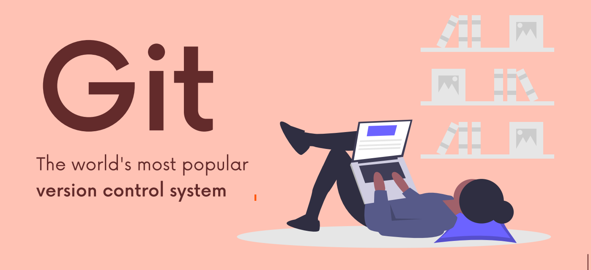

// in user directory
let's say you're in C:\Users\Shariar

$ git config --global user.name "Rifat Shariar Sakil"
$ git config --global user.email shariarsakil101@gmail.com

// get all global configuration
$ git config --global --list

// now get into working directory
$ pwd
output: C:\Users\Shariar

$ cd Desktop
$ mkdir Project
$ cd Project
$ git init

// start with git
$ touch index.txt

modify index file

// check status
$ git status

//start staging
$ git add index.txt
or (add all files to staging area)
$ git add --all

// start commit
$ git commit -m "commitMessage"

// add and commit in oneline
$ git commit -am "commitMessage"

// check git log
$ git log
or (for oneline git log history)
// git log --oneline

you can't commit without staging files

// for unstage
$ git rm --cached index.txt

modify => stage => commit  |=> sleep

//update last commit for forgotten file

$ git commit -m "someCommit"
$ git add forgotttenFile.txt
$ git commit --amend
now the editor will open up, and I'll update the commit message if needed and close the file

// Branch Merging
$ git branch
$ git branch experiment

$ git switch experiment
or
$ git checkout experiment

$ git switch -c experiment

$ git branch -v

// suppose you updated an existing file. without committing, you can't switch to another branch.
but you can switch to another branch if you add a non conflicting file. But the nonconflicting file
will follow you to the switched branch. 
   